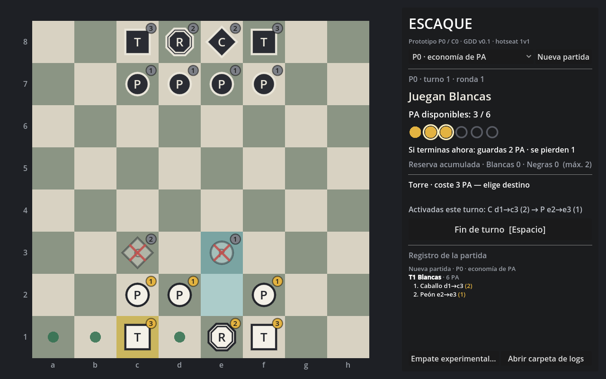

# ESCAQUE


**Juego táctico por turnos derivado del ajedrez en el que no mueves una pieza por turno: administras un presupuesto de Puntos de Acción.**

Cada pieza tiene un coste de activación distinto. Cada turno recibes 6 PA para repartir entre varias piezas, y puedes guardar hasta 2 para el turno siguiente. La pregunta deja de ser «¿cuál es la mejor jugada?» y pasa a ser «¿qué conjunto de jugadas merece mi presupuesto de este turno, y cuánto guardo?».



> Este repositorio es un **prototipo experimental**. Su objetivo es comprobar si la economía de activaciones produce decisiones interesantes y legibles; no es un juego terminado. El diseño completo está en el [GDD v0.1](docs/ESCAQUE_GDD_v0_1.md); el [Anexo A](docs/ESCAQUE_GDD_v0_1_Anexo_A_Chess2.md) analiza qué reglas de *Chess 2* pueden incorporarse.

---

## Hipótesis de diseño

> Sustituir la alternancia uniforme de una jugada por turno por una economía de acciones con costes distintos por tipo de pieza y reserva limitada puede producir decisiones recurrentes sobre qué objetivos tácticos perseguir, qué unidades activar y cuánto potencial presente sacrificar para obtener capacidad futura.

Para aislar esa hipótesis, el prototipo incluye dos modos:

| Modo | Qué es |
|---|---|
| **P0** · economía de PA | El diseño que se quiere probar. |
| **C0** · activación única | Control experimental: mismas piezas y tablero, una pieza por turno, sin PA ni Reserva. |

Comparar partidas P0 y C0 permite atribuir (o no) las diferencias a las activaciones múltiples, los costes y la Reserva.

## Reglas de P0

- Tablero 8×8, 2 jugadores, información completa, sin azar.
- **6 PA por turno + Reserva.** Al terminar el turno, `Reserva = min(PA restantes, 2)`; el resto se pierde.
- Cada pieza puede activarse **una vez por turno**: pagas su coste y haces exactamente un movimiento.
- Victoria: **capturar al Rey rival.** No hay jaque, enroque, *en passant* ni promoción.
- **Tablas automáticas:** repetición triple de la posición (contando PA disponibles y Reserva rival) o 30 turnos de jugador seguidos sin captura ni avance de peón. El panel muestra ambos contadores cuando empiezan a acercarse al límite.
- **Tablas pactadas:** botón **Tablas…**, con la causa observada.

### Reglas opcionales (desactivadas en P0)

Se activan en `data/escaque_rules.json` (bloque `rule_options` o por modo) y se comparan en el laboratorio de reglas:

| Opción | Efecto |
|---|---|
| `promotion` | El peón que llega a la última fila corona automáticamente al tipo indicado (p. ej. `"rook"`). |
| `midline_victory` | Se gana si el Rey empieza su turno en la mitad rival (entró y sobrevivió al turno del rival). El tablero marca la línea media. |
| `pawn_retreat` | El peón puede retroceder una casilla, sin capturar, pagando `coste × pawn_retreat_cost_factor` (2 por defecto). |
| `no_moves_loses` | Quien empieza su turno sin ninguna jugada legal pierde. |
| `max_range` (por pieza) | Alcance máximo de las piezas deslizantes; `0` = sin límite. |

Además de las piezas de P0 están definidos el **Alfil** (A, diagonal, alcance 3, 2 PA) y la **Dama** (D, 8 direcciones, alcance 3, 4 PA), listos para usarse en otras colocaciones.

| Pieza | Nº | Coste | Movimiento |
|---|:-:|:-:|---|
| Peón (P) | 4 | 1 | Avanza 1 si está libre; captura 1 en diagonal hacia delante. Sin avance doble. |
| Caballo (C) | 1 | 2 | En L, salta piezas. |
| Torre (T) | 2 | 3 | Ortogonal, cualquier distancia, no atraviesa piezas. |
| Rey (R) | 1 | 2 | 1 casilla en cualquier dirección; puede entrar en casillas amenazadas. |

```text
    a b c d e f g h
8 | . . r k n r . . |
7 | . . p p p p . . |
2 | . . P P P P . . |
1 | . . R N K R . . |
```

## Cómo jugar

**Requisitos:** [Godot 4.4](https://godotengine.org/download) o superior (versión estándar, no .NET).

1. Clona el repositorio:
   ```bash
   git clone https://github.com/kognar-dev/JuegoEscaque.git
   ```
2. En Godot: **Importar** → selecciona `project.godot`.
3. Pulsa **F5**.

Se puede jugar *hotseat* (dos personas en la misma pantalla) o **contra la IA**: los selectores **Blancas** y **Negras** eligen Humano, IA fácil, IA normal o IA difícil para cada bando, y se pueden cambiar a mitad de partida. Con los dos en IA, la partida se juega sola.

| Acción | Control |
|---|---|
| Seleccionar pieza | clic izquierdo (en piezas rivales muestra su alcance en azul, sólo consulta) |
| Mover / capturar | clic en destino: punto verde = mover, anillo rojo = capturar |
| Cancelar selección | clic derecho o `Esc` |
| Terminar turno | botón o `Espacio` / `Enter` |
| Cambiar de modo | desplegable P0 / C0 + **Nueva partida** |
| Tablas pactadas | botón **Tablas…**; pide la causa observada y la registra (`Enter` confirma) |
| Informe de partidas | botón **Informe**: analiza todos los logs y abre el informe |

**Cómo leer el tablero**

- La insignia de cada pieza muestra su coste: **dorada** si puedes pagarla, **roja** si no te alcanzan los PA, **gris** fuera de tu turno.
- **Aspa roja** = pieza ya activada este turno.
- En el panel, los PA con **anillo claro** son los que guardarías como Reserva si terminases ahora.

## Variantes sin tocar código

Todos los parámetros viven en [`data/escaque_rules.json`](data/escaque_rules.json): tamaño del tablero, colocación inicial, jugador inicial, coste y patrón de movimiento de cada pieza, y los modos (`base_ap`, `max_reserve`, `max_activations_per_piece`).

Para probar un balance distinto, añade un modo nuevo:

```json
"P0.2": {
    "label": "P0.2 · 5 PA, reserva 3",
    "economy": "ap",
    "base_ap": 5,
    "max_reserve": 3,
    "max_activations_per_piece": 1
}
```

Aparecerá automáticamente en el desplegable.

El bloque `end_rules` controla el fin de partida automático (`repetition_limit`, `no_progress_turns`, `no_moves_loses`; `0` desactiva un límite). Cada modo puede sobrescribir cualquiera de esas claves.

## Telemetría

Cada partida se guarda como JSON en la carpeta de datos de usuario de Godot (en Windows, `%APPDATA%\Godot\app_userdata\ESCAQUE\logs`). El botón **Abrir carpeta de logs** la abre directamente.

| Nivel | Datos |
|---|---|
| Partida | modo, configuración usada, jugador inicial, ganador, motivo de final, duración |
| Turno | PA iniciales, gastados, reservados y perdidos, nº de activaciones, secuencia de tipos |
| Acción | pieza, coste, origen, destino, captura y tipo capturado |
| Resumen | por jugador: histograma de reserva (0/1/2), PA perdidos, secuencias de activación más usadas, capturas |

El resumen está pensado para detectar los riesgos del diseño, como guardar siempre 2 PA o que una combinación de piezas domine.

### Informe comparativo C0 / P0

El botón **Informe** (o `godot --headless --path . -s res://tools/analyze_logs.gd -- [carpeta] [salida.md]`) lee todos los logs y genera `informe_escaque.md` con:

- comparativa entre modos: victorias del primer y segundo jugador, tablas, duración, activaciones y capturas por turno;
- economía de PA: reparto de la Reserva, turnos que lo gastan todo, **ahorro deliberado** (guardar PA pudiendo activar), PA perdidos, concentración frente a dispersión y composiciones de turno más frecuentes;
- **dependencia de orden (H-P0-3):** reproduce cada partida y cuenta las activaciones que sólo eran legales gracias a otra anterior del mismo turno;
- una tabla de indicios para el criterio de avance del GDD (§18) y los riesgos del §9, marcados como «favorable», «alerta» o «muestra insuficiente».

Los umbrales son heurísticos y están al principio de `core/log_analyzer.gd`.

## IA

La IA planifica el turno completo: un turno de ESCAQUE es una secuencia de activaciones con PA limitados, así que usa una **búsqueda en haz** sobre secuencias (amplía los mejores planes parciales con cada activación posible y puede parar en cualquier paso para guardar PA). Evalúa cada posición resultante mirando un turno del rival por delante de forma heurística:

- ¿puede el rival capturar mi Rey con sus PA, directamente o apartando antes una pieza propia que tapa la línea?
- ¿qué material puede ganarme de forma rentable con su presupuesto?
- material, presión sobre el Rey rival, avance de peones (más si hay promoción), Reserva, línea media si está activa, y evitar repetir posiciones cuando va por delante.

Los niveles cambian la anchura del haz y el ruido. Los pesos están al principio de `core/ai_player.gd`. Es una IA para probar reglas y tener rival, no un motor fuerte: no busca varios turnos hacia delante.

## Laboratorio de reglas

Juega partidas IA contra IA con variantes de reglas y compara resultados: partidas decisivas, tablas por motivo, duración, ventaja del primer jugador, uso de la Reserva y dependencia de orden.

```bash
godot --headless --path . -s res://tools/rule_lab.gd -- [experimentos.json] [partidas_por_variante]
```

Las variantes se definen en [`data/lab_experiments.json`](data/lab_experiments.json) como un modo base más cambios por ruta, sin tocar código:

```json
{"id": "P0 T3 + Alfiles", "mode": "P0", "set": {
    "pieces.rook.max_range": 3,
    "setup": [".brknrb.", "..pppp..", "........", "........", "........", "........", "..PPPP..", ".BRNKRB."]
}}
```

El informe y los logs de cada variante se guardan en la carpeta de datos de usuario, en `lab/`. Mide dinámica, no equilibrio fino: la IA no juega como un experto.

## Estructura del proyecto

```text
core/                  reglas puras, sin dependencias de interfaz
  rules_config.gd        carga de parámetros desde JSON
  piece.gd               datos de pieza
  board.gd               tablero, ocupación, movimiento y captura
  move_generator.gd      patrones: pawn / leaper / slider
  game_state.gd          estado de la partida
  turn_controller.gd     PA, Reserva, activaciones, fin de turno, C0
  victory_system.gd      captura del Rey, tablas automáticas, sin jugadas, empate experimental
  match_logger.gd        telemetría JSON
  log_analyzer.gd        informe C0 / P0 a partir de los logs
  ai_player.gd           IA: búsqueda en haz sobre secuencias de activaciones
  rule_lab.gd            laboratorio de reglas: variantes, partidas IA contra IA, informe
  match_controller.gd    fachada que usan la interfaz y los tests
ui/                    tablero dibujado por código, contador de PA, escena principal
scenes/main.tscn
data/escaque_rules.json
tests/test_rules.gd    tests de reglas, opciones, IA, laboratorio + 300 partidas aleatorias
tools/analyze_logs.gd  informe desde la línea de comandos
tools/rule_lab.gd      laboratorio de reglas desde la línea de comandos
data/lab_experiments.json  variantes del laboratorio
docs/                  GDD y anexos
```

La lógica está separada de la interfaz, de modo que las ramas futuras del diseño (terreno, leyes, niebla…) puedan añadirse como módulos sobre el mismo núcleo.

### Tests

```bash
godot --headless --path . -s res://tests/test_rules.gd
```

Cubren los criterios de aceptación y las pruebas funcionales del GDD (§14, §15.1) y comprueban invariantes en 300 partidas aleatorias.

## Hoja de ruta

Siguiendo el orden de experimentación del GDD (§12). Cada fase sólo se aborda si la anterior da evidencia favorable:

- [x] **Fase 0 · P0 + C0**: implementación jugable, telemetría y tests.
- [x] **Fase 0 · infraestructura de pruebas**: tablas automáticas, regla opcional sin jugadas e informe comparativo C0/P0 ([Anexo A](docs/ESCAQUE_GDD_v0_1_Anexo_A_Chess2.md), paso 1).
- [x] **Fase 0 · herramientas de prueba**: IA (humano contra IA), laboratorio de reglas y reglas opcionales (promoción, línea media, retroceso de peón, alcance, Alfil y Dama).
- [ ] **Fase 0 · pruebas**: primera batería de partidas C0/P0 y análisis de logs.
- [ ] **Fase 1 · P0.2**: ajuste de PA, Reserva, costes y colocación.
- [ ] **Fase 2 · E1 TERRAIN**: casillas normal / difícil (+1 PA) / bloqueo.
- [ ] **Fase 3 · E3 LAW o E2 MORPH**: una transformación estructural.
- [ ] **Fase 4 · E4 FOG**: información incompleta.
- [ ] **Fase 5 · E5 AUTO / E6 DEFENCE**: ramas de agencia.

## Licencia

[MIT](LICENSE) © 2026 kognar-dev
